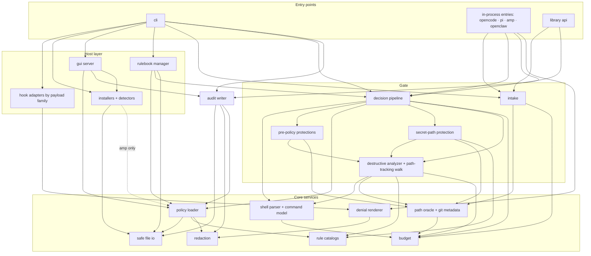

# Greenfield Design (isolated architect; input = behavioral-contract.md only)

# 1. Reading of the contract

The system is a pure function with two side channels: `(host payload, filesystem view, policy files, environment) → allow | deny(reason, intent, rule id, evidence)`, plus one audit line per decision and, outside the hot path, CLI/GUI surfaces reading the same files. Everything else is tooling to arrange for the function to be called by thirteen hosts.

Hardest requirements: (1) bounded structural understanding of shell without becoming a shell — "structural finding" and "unverifiable → deny in strict" must both be first-class so the residual-risk line is expressible; (2) two opposite failure policies in one call (internal error → deny; invalid config → never deny, always protect, always report) with an unforgeable classification of whose fault; (3) protections before policy, yet needing the same path machinery as the analyzer — dependency direction must let path machinery serve both without policy influencing protections; (4) thirteen hosts, one cold process per call for nine, in-process ESM for four, from a git checkout.

Should NOT be built: shell emulation (glob/brace/IFS, alias/PATH tables); script-file analysis; interpreter language parsers; resident daemon or cross-call cache; third-party code plugins for rules; rulebook auto-refresh; telemetry/metrics; remote/multi-tenant; network on decision path; host config backups; GUI beyond policy editing and activity review (star/health/install endpoints as thin droppable wrappers); a config migration framework; compile-time policy artifacts; a generic capability lattice.

# 2. Three candidates

## A — Staged pipeline over one rich command model
Parse once into a provenance-carrying tree; fixed nine-stage pipeline mirroring the contract's order, each stage `(invocation, Program, context) → Finding | null`, first finding wins; hosts as code adapters mapping payload → canonical envelope and decision → host document; policy re-read per call into immutable snapshot; one process/call or one function call, same core. Sync hot path. Extension: new host = one directory + one list entry; new rule = catalog entry + predicate + corpus. One catch boundary. Advantages: order is structural, single parse feeds all stages, explain via passive trace sink, pure core. Disadvantages: parser+walker are the bulk and the liability; thirteen small adapter modules; rich tree costs ms on 90 KB inputs.

## B — Cheap pre-screen then deep analysis; table-driven hosts; compiled policy
Linear vocabulary/path-shape pre-screen allows untriggered commands after pre-policy protections; only triggered commands reach the full parser; hosts as declarative descriptors with a generic adapter; policy compiled to a stamped artifact. Fatal disadvantages for this contract: two oracles (every structural-only deny like `$(printf r)m -rf /`, `find . -delete` under a wrapper, `xargs r$(printf m)`, `parallel` alone, `git checkout a b`, `f=.env; cat "$f"` must also be a trigger or the pre-screen becomes "anything with $ | find xargs git or a path" and buys nothing); compiled artifact violates re-read-per-call and live rulebook edits; descriptors fail for Copilot's JSON-string toolArgs, Hermes shim, OpenCode throw-to-deny, Amp helper workspace, OpenClaw host allow-list (five of thirteen need code). Best when calls are hundreds/second and hosts uniform — not here.

## C — Uniform prioritized rule engine over annotated token stream
Everything is a prioritized rule over a flat annotated token stream; capability lattice; tiny shims; optional daemon. Disadvantages: contract semantics are tree-shaped (per-path cwd, heredoc→file→exec, substitutions first, synthesized xargs/parallel children, iterative wrapper peel, function inlining) so every rule re-derives structure or a hidden walker appears; priorities replace fixed order with numbers (protections-before-policy becomes a sorted-list property); lattice over-general for three booleans; daemon saves 10–20 ms but adds lifecycle/staleness/auth and violates re-read. Best when rules are vocabulary-shaped — the catalog is far past that.

# 3. Recommendation: A, with two borrowings
From C: built-in rules carry declarative metadata `{id, intent, catastrophic, gate}` so the filter and explain's ruleActivation are table lookups. From B: hosts grouped by payload family (Claude-shaped serves Claude Code/Codex/Kimi; attribution is a small override) — but families are code, not a descriptor language.

Invariants become structural: I1 by import direction (protections cannot import the policy loader); I2 by the catastrophic flag in one filter; I3 by one allow-path function; I9 by no module-level state and an import lint forbidding http/net in core; I10 by sequential code; I11 by the custom rule type having no allow variant.

Stack from the contract: TypeScript on Node ≥18 (four hosts import ESM; git-checkout plugins; native binary would need per-platform committed artifacts); ESM single-file bundles with NO module-level work and a hook path that loads only the decision code; one runtime dependency (schema validator) precompiled at build so the hot path pays nothing; plain JSON/JSONL; synchronous hot path; no third-party shell parser.

# 4. Specification

## 4.1 Boundaries
Inside: adapters, in-process entries, decision core, policy loading, audit, CLI, installers, rulebook management, GUI, library API, skill/manifests. External: 13 host CLIs and their config/plugin stores; filesystem and git (read-only); GitHub (rule add/update only); npm registry (doctor only); browser; Hermes Python shim (generated by us); Amp hosted repo.

## 4.2 Components (responsibility · state · deps · prohibited · failure · why · if removed)
- **Hook adapters** (one per stdin host, grouped by payload family): payload → RawInvocation; Decision → host document; declare containment mode, tool→route table, fail mode. No state. Deps: envelope types, denial renderer. Prohibited: parser, analyzer, policy loader, filesystem. Adapter throw → runner emits explicit deny in host format; if rendering fails, generic Claude-shaped deny. If removed: hosts cannot be spoken to.
- **In-process entries** (OpenClaw, OpenCode, Pi, Amp): host-facing function; builds RawInvocation using host helpers where the contract says; runs intake+pipeline; converts decision to return/throw; converts ANY thrown value into host deny form; never returns undefined after an exception. Amp entry carries embedded policy copy.
- **Intake**: bounded stdin (8 MiB), JSON, object/tool-name checks, bounded traversal caps, route table, exec-dir resolution (exists, dir, canonical, not UNC/device when requested, contained when mode=contain), policy dir; → ToolInvocation | Deny | Skip. Deps: path oracle, budget. Prohibited: policy loader, analyzer. If removed: 13 copies of caps/cwd rules.
- **Decision pipeline**: nine stages in fixed order; single catch boundary; assembles Decision + AuditFacts (stage, errorCode, policy state, level); attaches config warning. Prohibited: adapters, audit writer (runner audits after the pipeline so audit failure cannot alter a decision), network. AnalysisLimit → "exceeds safe analysis limits…"; else → "failed closed because … unexpectedly".
- **Shell parser + command model**: text+dialect → Program with status; auto-detection from command-position PowerShell cmdlets; structural limits. Pure; deps: budget only; never throws except AnalysisLimit. If removed: only raw-text backstop remains.
- **Path oracle** (superseded by §8.5: no twelve-duty oracle; Git facts come through the environment seam): single choke point for path facts: ~/$HOME/env expansion, MSYS translation, Windows namespace detection, budgeted realpath (16,384 / 4 MiB / 256), entry kind, trusted-temp class, nearest `.git`, gitdir/commondir, hooks subtree, linked-worktree verification, symlink-refusing existence. State: per-call memo + counters. → `Resolved {canonical, kind, isDynamic?, class: root|home|gitMetadata|trustedTemp|insideCwd|outsideCwd|unknown}`. fs error → unknown (treated unsafe); budget → AnalysisLimit. If removed: five re-implementations of realpath discipline.
- **Pre-policy protections** (stages 2–4): collect targets from write/edit/patch tool inputs and shell operands/=values/redirections/rm -r ancestors/mv sources/find -delete roots after cd/variable/expansion tracking; match user policy path, project policy path, `policy apply` runner spellings, git metadata. Deps: model, oracle, the analyzer's shared path-tracking walk. Prohibited: policy loader (import direction). Pseudo-ids policy-protection, policy-apply-protection, git-metadata-protection; hard_stop.
- **Policy loader**: the whole layering — defaults, user policy.json with section-wise salvage, project policy.json with merge + weakening lines, both rule.json (scope drops on malformation), live rulebooks (v1/v2 schema, name match, vendored-only), env with raise-only level, capability provenance; plus `readRetentionDays` sharing the salvage path. Never throws for content; I/O error → source missing/malformed (degraded); a genuine bug throws → pipeline denies at config-load. → PolicyResolution. Prohibited: parser, analyzer, audit, adapters, network. If removed: every surface hand-rolls layering.
- **Secret-path protection** (stage 6): candidate collection from Program (operands, assignment values, redirections, substitution bodies, echo|xargs reader, piped scripts, interpreter literals with base64, curl -d @/-F @, find roots/-exec bodies, awk operands/getline) or tool path fields or patch headers; deny paths (never relaxed) then built-in secret rules filtered by overrides and allow paths (three never-cover cases); two standard-mode relaxations. Deps: model, oracle, secret catalog, host credential-root table. Prohibited: audit.
- **Destructive analyzer**: status handling; path-set walk (cwd knowledge, env tracking, heredoc files, function inlining, connector semantics, isolation, substitutions first); per-simple-command fixed order (assignment strip, wrapper peel, strict dynamic checks, transparent wrappers, eval/trap/shell wrappers/source/stdin/awk/interpreters/busybox/device/head rule sets/unknown-head suffix search/custom rules); worktree relaxation; raw-text backstop; rule filter; budgets; trace emission. Exposes its **path-tracking walk** as a function used by protections and secret stages — one walker, three consumers (superseded by §8.1: two walks by design). Deps: model, oracle, catalogs, budget, one sync `git config --get submodule.recurse` spawn (sanitized env, timeout) reachable only from worktree verification. Prohibited: policy loader (receives resolved capabilities), audit, adapters, network.
- **Rule catalogs**: 59 destructive records `{id, intent, catastrophic, gate?, reason}`; 134 secret records `{id, matcher kind, defaultOn, exemptions}`; custom-rule compiler (v1 basename/subcommand/block_args with short-option expansion and known value-taking git/docker options; v2 command_path/any_args/exclude_args skipping aws/gcloud/az value-taking globals). Static; no deps. If removed: filter becomes a switch new rules forget.
- **Denial renderer + redaction**: pure; the §6.5 frame with footers, Tool line only for non-analysis denials, Segment only when different, Config warning when degraded, 200-char caps; one redaction function at every egress.
- **Audit writer**: W6 layout, record shaping with caps, redaction of four fields, 0600/0700 append, retention prune ≤ once per UTC day via the loader's projection, symlink refusal, never throws. Deps: safe io, redaction, loader projection. Prohibited: pipeline, adapters.
- **Safe file I/O**: symlink-refusing open, identity check between open and read, bounded read, atomic write (temp same dir, fsync, rename, modes), JSONC/TOML surgical edits.
- **CLI**: §6.1 parsing incl. legacy spellings; dispatch; exit 0/1; stderr discipline; each subcommand a thin composition.
- **Installers + detectors** (13): detect from host state files (never state-mutating host commands), probe with 5 s timeout, write exact artifacts atomically, refuse symlinked/unmanaged, clear npx/bunx caches, precise uninstall, per-host report; the managed hook command is a shared constant with the adapter so install/detect/adapter cannot disagree. Prohibited: pipeline, policy loader (except Amp installer).
- **Rulebook manager**: rule subcommands; bounded GitHub fetch; vendor via temp+rename; acceptance limits; fixture evaluation through the real pipeline (data, never executed); re-load changed scope exactly as the gate. Only here + doctor + installers + GUI may import https.
- **GUI server** (lower priority): loopback, ephemeral port, token in URL + header for POST, 1 MiB bodies; endpoints as wrappers over loader/apply/audit reader/detectors/installers; project-draft compare-and-swap on content hash; false-positive scrubber. Nothing imports it.
- **Library API**: `checkCommand({command, cwd})` → synthetic RawInvocation (host 'library', shell/auto, containment 'usable') → intake → pipeline; audit off; TypeError on shape errors; deny for unusable cwd; exceptions propagate.

## 4.3 Dependency model
Four tiers, strictly downward: entry points (CLI, in-process entries, library) → host layer (adapters, installers/detectors, GUI, rulebook manager) → gate (intake, pipeline, protections, secret, analyzer) → core services (parser/model, oracle, catalogs, loader, budget, redaction, renderer, safe io). Audit beside the gate, called by entry points after the pipeline, depends only on core. Within the gate, stages depend on each other only via the shared walk. The loader is never imported by protections or analyzer. Core imports Node built-ins and each other in fixed order (budget ← redaction ← safe io ← oracle ← parser ← catalogs ← loader). Import-graph lint: core/gate never import host/entry; no http/https/net outside rulebook manager, GUI, installers, doctor.



## 4.4 Data and control flow
Tool-call gate (stdin host): runner selects adapter by flag → bounded stdin → adapter.parse → intake → pipeline (parse once; protections over the same Program; policy load; secret; non-shell allow; blank deny; analyzer) → Decision → audit append (allows only shell routes when scope=all) → adapter.render → stdout → exit 0. Unsupported event → no output.
Policy resolution: one function called by doctor/status/statusline/explain/GUI/policy check, rendered as different projections.
Install: probe in parallel → read host state → write artifact atomically or run host install command → clear caches for npx hosts → verify where required → report.
Explain: synthetic Claude-shaped shell invocation with --cwd → pipeline with recording trace sink and `prePolicyDialect: posix` hint (superseded by §8.4: the real dialect, no hint) → render; every string redacted; exit 1 only for bad flags or AnalysisLimit.

```mermaid
sequenceDiagram
  participant HC as Claude Code
  participant R as hook runner + claude-shaped adapter
  participant I as intake
  participant P as pipeline
  participant S as parser
  participant PR as protections
  participant L as policy loader
  participant A as analyzer
  participant AU as audit writer
  HC->>R: stdin {PreToolUse, Bash, {command:"git reset --hard"}, cwd, session_id}
  R->>R: bounded read, JSON parse, event check
  R->>I: RawInvocation(shape=claude-code, route=shell/posix, containment=none)
  I->>I: traversal caps ok; cwd exists, dir, canonical
  I->>P: ToolInvocation
  P->>S: parse(command, posix, budget)
  S-->>P: Program(complete)
  P->>PR: stages 2–4
  PR-->>P: null
  P->>L: load(configRoot, projectDir, env)
  L-->>P: PolicyResolution(ready, standard)
  P->>P: stage 6 none · 7 n/a · 8 non-blank
  P->>A: analyze(Program, ctx)
  A->>A: walk → simple → peel none → head "git" → reset --hard → filter enabled
  A-->>P: Finding{git.reset-hard, use_alternative, "git reset --hard"}
  P-->>R: Decision.deny + AuditFacts{command-analysis, standard}
  R->>AU: append (failure swallowed)
  R-->>HC: {hookSpecificOutput:{PreToolUse, deny, reason}} · exit 0
```

```mermaid
sequenceDiagram
  participant HC as Cursor
  participant R as hook runner + cursor adapter
  participant P as pipeline
  participant A as analyzer
  participant O as path oracle
  participant B as budget
  participant AU as audit writer
  HC->>R: {Shell, {command:"rm -rf a/{b,c,...}/{...}"}, cwd, workspace_roots}
  R->>P: ToolInvocation
  P->>P: parse ok; protections none; policy ready; secrets none
  P->>A: analyze
  A->>A: rm: brace targets capped at 64
  loop each target
    A->>O: resolve(target, cwd)
    O->>B: charge(realpath)
    B-->>O: > 16,384 → throw AnalysisLimit(path-canonicalization-limit)
  end
  O-->>A: propagates
  A-->>P: propagates
  P->>P: catch: deny{"exceeds safe analysis limits…", stop_and_explain, command-analysis, path-canonicalization-limit}
  P-->>R: Decision.deny
  R->>AU: append (failureStage, errorCode, uncapped command)
  R-->>HC: {permission:"deny", user_message, agent_message} · exit 0
```
A corrupted rulebook is not a failure path: loader drops the source, degraded reason, pipeline proceeds, audit gets configFallback, next denial carries Config warning; `printf safe` still allows.

## 4.5 State model
Authoritative (user-owned): user/project policy.json, both rule.json, vendored rulebooks, env. Written only via policy apply, GUI, rule commands, through the atomic writer. Derived transient per call: ToolInvocation, Program, PolicyResolution, walk state, Budget, realpath memo, trace. Persisted by the system: audit JSONL, a prune marker (last UTC day), host artifacts, Amp's embedded policy copy (retained only for Amp, documented stale-by-design, refreshed on update). One writer per file; no locks; atomic rename; per-session audit files; O_APPEND; GUI CAS on content hash. All readers go through the loader. Writes validate the full document first (policy check = apply minus write); rulebook vendoring validates before rename. Recovery: crash mid-write leaves a uniquely named temp file no reader considers; prune idempotent; half-installed host detectable by doctor and repaired by idempotent install.

## 4.6 Interfaces
```
RawInvocation { host: HostId; shape: PayloadShape; sessionId: string|null; toolName; toolInput: unknown;
  route: ShellRoute | FileRoute; cwd: { requested; session; roots; containment: 'contain'|'canonicalize'|'usable' };
  policyDirHint; transcriptPath? }
ShellRoute = { kind:'shell'; dialect:'posix'|'powershell'|'auto'; command }
FileRoute = { kind:'path'|'patch'|'grep'|'glob'|'unknown' }
ToolInvocation = RawInvocation & { execDir; policyDir; dialect: 'posix'|'powershell' }

Decision = {kind:'allow'} | {kind:'deny'; reason; intent; ruleId?; evidence?; toolName?; configWarning?}
Intent = 'hard_stop'|'use_alternative'|'scope_down'|'manual_only'|'stop_and_explain'
AuditFacts = { stage; errorCode?; level?; degraded; shape }
Stage = 'policy-protection'|'config-load'|'secret-protection'|'non-command'|'command-validation'|'command-analysis'
ErrorCode = 'path-canonicalization-limit'|'tool-input-limit'|'structural-shell-syntax-limit'|'unexpected-error'

Program { dialect; status:'complete'|'partial'|'invalid'|'limited'; detail?; list: Node[]; source }
Node = Simple | Pipeline | Group | FunctionDef | Op
Simple { assignments; words: Word[]; redirections; span; background }
Word { text; raw; quoted:'none'|'single'|'double'|'mixed'; provenance:'literal'|'variable'|'command-substitution'|'arithmetic'|'glob'|'unknown'; parts: Part[] }
Redirection { op; target: Word | Heredoc }
Heredoc { delimiterQuoted; body; live: Program[] }
SimpleView (built by walker): head(), tokens(), option(name), operands(), isDynamic(word), cwdKnown, resolve(word)→Resolved (via oracle+budget), env(name), heredocFile(path), capabilities, inEmbeddedContext, worktreeVerified() (lazy, memoized)

BuiltinRule { id; intent; catastrophic; gate?; reason }
HeadRuleSet = (cmd: SimpleView, ctx) => Finding | null   // rm, git, find, xargs, parallel, remove-item, dd, mkfs, shred, awk, interpreter, shell-wrapper…
Finding { source: builtin|custom|raw-text|unverifiable|protection; reason; intent; evidence; relaxableByWorktree }
SecretRule { id; match(candidate, ctx); defaultOn; cliCredential; exemptions }
CustomRule { id: `custom.${rulebook}/${rule}`; match(tokens); reason; intent; meta }   // tokens only — cannot observe paths/env/cwd

PolicyResolution { state: ready | degraded{reason}; effective { level; selectedPreset; capabilities; worktreeMode; destructive{enabled, overrides, allowPaths}; secret{enabled, overrides, denyPaths, allowPaths}; audit{retentionDays}; customRules; transparentWrappers }; provenance; scope{levelScope, weakenings}; diagnostics[{severity, code, file, message}] }

HookAdapter { id; flags; shape; parse(payload, env) → RawInvocation | {skip} | {invalid}; render(decision, inv) → string|null; failMode }
HostInstaller { id; probe; detect(env); install; uninstall; update; managedCommand }
TraceSink { step(TraceStep) }  // no-op in hook path
```

## 4.7 Error model
Categories: invocation errors (fixed strings, command-validation, no echo); analysis limits (typed AnalysisLimit{kind}; stop_and_explain; retryable only after restructuring); internal bugs (deny "failed closed unexpectedly", unexpected-error, stack to stderr only under debug); configuration errors (never deny; degraded with logical file, fallback, repair; on every surface); audit/prune (swallowed); CLI usage (stderr, 1); install (per-host, 1 if any failed, idempotent rerun); rule fetch (nothing written); GUI (401/409/413/500). Only AnalysisLimit is thrown intentionally inside the gate; one catch boundary; entries/runner wrap again so a runner bug still yields a deny document. Exit codes: hook 0 always (1 only if writing the document fails); status 0; doctor 1 iff error finding/self-test failure; explain 1 for bad flags/limit; install 1 if any host failed.

## 4.8 Concurrency
Single-threaded synchronous hot path; one sync git spawn with sanitized env and timeout only on the worktree path. Races: policy replaced between open/read → identity check + symlink refusal; concurrent audit appends → O_APPEND single write; GUI write vs hook read → atomic rename; two GUI tabs → CAS 409; concurrent prunes → idempotent. Ordering: sequential stages; substitutions first; first deny wins; skipped segments recorded. No cancellation; budgets not timers bound work (determinism). Idempotent decisions/installs/prune; audit at-most-once. Budget: one Budget object per call with named counters for every cap; counters independent; overflow unified: every breach throws AnalysisLimit{kind} → errorCode (four public classes) → reason text (two documented wordings + recursion-depth); intake caps checked before Budget exists; parser `limited` is the one non-throwing breach because it is a contract-visible parse outcome.

## 4.9 Configuration
Precedence defaults → user → project (may weaken, reported) → env (raise-only level; capability flags force on). Validation as contract. Defaults as contract. No secrets in config; GUI token process-lifetime. Everything re-read per call. Invalid-config: never deny ordinary work, never enforce rejected values, secret protection's protective default is on.

## 4.10 Security
Trust boundaries as contract. Privileged: policy apply (TTY, no --yes, agent-invocation denied at stage 3); host config writes; rulebook vendoring; GUI writes. Untrusted inputs: caps before parse; no eval/dynamic require; no shelling out with agent strings (git spawn fixed args, sanitized env); hand-written linear parser; bounded literal searches for raw text; base64 size-capped. Redaction at every egress. Path safety via the oracle only. One dependency precompiled; no postinstall. Secure failure as contract.

## 4.11 Observability
Audit primary; explain passive on demand; doctor with stable finding ids; status/statusline projections; GUI health = doctor projection; debug env → stderr; no metrics/telemetry; redaction everywhere; scrubber for reports; 0600 files.

## 4.12 Extension
Open: new host = `hosts/<id>/` (hook adapter or entry + installer + detector + managed-command constant) + one entry in a plain array; Claude-shaped hosts = five-line family override. New destructive rule = one catalog record + one predicate in the head rule set (or a new head rule set wired into the dispatch table) + corpus rows at standard and strict (+ one raw-text pattern if vocabulary-visible). New secret pattern = catalog record + corpus. New rulebook source = data. New capability (rare) = four known sites documented, not abstracted. Closed: third-party code rules; new intents; network on decision path; alternative storage; resident process; parser fidelity for residual families (review rule); host descriptor DSL; GUI as independent app.

## 4.13 Testing
Conformance corpus as primary oracle: table rows `{command, dialect?, cwd?, policy fixture, level, expect}` run through `runPipeline(ToolInvocation, deps)` with a fake path oracle (in-memory tree with symlinks, git metadata, temp roots) and fixture policies, at standard and strict; must not depend on structure. Domain tests (structure-dependent, allowed to break on refactor): parser status/provenance per construct; walker cwd knowledge per connector; rm classification order; secret candidate collection per source; policy salvage per section; redaction patterns; budget breach per counter. Contract tests for adapters: recorded payload → RawInvocation; decision → document bytes; per fail mode; unsupported event → no output. Installer tests with fake host configs → exact artifacts → detect → uninstall byte-identical (JSON comment loss asserted). Integration: real temp fs with symlinks, real git repo with linked worktree and submodule, real policy files; run the bundle via node with stdin; assert stdout, exit, audit line. E2E: packed tarball on six-cell matrix; git-checkout mode. Property-based: random strings under caps → Decision without exception within fixed budget; catastrophic corpus denies survive sudo/env/command/bash -c wrapping; corpus allows survive appended message-sink heredocs. Concurrency: audit appends; GUI CAS. Failure injection: oracle EACCES/ELOOP; file replaced between open/read; unwritable audit dir; corrupted rulebook; oversized stdin; toolInputTruncated; 1,025 GIT_CONFIG_COUNT. Compatibility: golden files for denial frames, audit records, explain/doctor JSON finding ids; rule-id snapshot (additive only); host artifact goldens.

## 4.14 Repository structure
```
src/core/          parser+model, path oracle (superseded by §8.5: environment seam), catalogs, policy loader, budget, redaction, denial renderer, safe io
src/gate/          intake, pipeline, protections, secret protection, analyzer (walk, peel, recurse, rules/<head>, raw-text, filter, worktree)
src/audit/         writer, reader, retention
src/hosts/<id>/    hook adapter or in-process entry, installer, detector, managed-command constant
src/cli/           arg parsing, one file per command, formatting
src/gui/           server, endpoints, static page
src/rules-manager/ rule subcommands, github fetch, vendoring, fixture evaluation
src/lib/           checkCommand
src/entries/       bin entry, opencode/pi/amp/openclaw export entries
schemas/           published JSON Schemas → precompiled validators
tests/             mirrors src/; corpus/ (conformance table); fixtures/ (payloads, artifacts, policies)
docs/              authoring guide, host protocols, residual-risk boundary
dist/              committed artifacts
.claude-plugin/, hooks/, kimi.plugin.json, skills/
```
Rules: core imports only Node + core; gate imports core; audit imports core; hosts import gate/core/audit; cli/gui/rules-manager/lib/entries import anything below. No http/https/net/child_process below hosts except the oracle's git query and installers/rules-manager/doctor. Must not be placed: host names in gate/core (except the secret catalog's credential-root data); policy reading in protections; audit calls in gate; test-only exports without @internal; executables in schemas/skills.

# 5. Ablation
(Per component, summarized.) Adapters/entries: external formats, not mergeable. Intake: mergeable into adapters but that is the I14 duplication. Pipeline: mergeable into the hook runner only if explain and library dropped. Parser/model: without it only raw-text + tool-field secrets remain; `cd .. && rm -rf build`, `find . -delete` under wrapper, worktree mode, strict dynamic-executable, and I12 false-positive guarantees vanish (vocabulary blocks `echo "rm -rf ~"`). Oracle: mergeable into analyzer but inverts layering. Protections: not mergeable (run before policy). Loader: not mergeable. Secret: mergeable with analyzer only for shell routes. Catalogs: mergeable at the cost of id drift. Renderer/redaction: leakage risk. Audit: cleanest optional. Safe io: per-writer re-implementation. Installers/rulebook manager/GUI/library: optional.

Mandatory core: intake + pipeline + parser/model + oracle + protections + loader + secret + analyzer + catalogs + renderer + redaction + safe io + one adapter/entry + bin entry. Optional: audit, explain, status/doctor/statusline, installers, rulebook manager, GUI, library, remaining twelve hosts.

Reintroducing constraints: (1) product only → the core with the corpus; no process model; catalog-as-data already justified by filtering semantics. (2) runtime/ops → TS/ESM, bundles with no module-level work, sync hot path, precompiled validators, no daemon/cache, dist committed, separate entries. (3) security/reliability → catch boundary, Budget, identity-checked symlink-refusing reads, atomic writes, UNC rejection, redaction at every egress, sanitized git env, loader "content never throws", audit-after-pipeline, TTY gate, loopback token, protections-cannot-import-policy. (4) external compat → thirteen adapters/entries with exact documents and fail modes, family grouping, CLI with legacy spellings, denial frame verbatim, exit codes, rule-id snapshot; containment modes become descriptor fields. (5) formats → version 1 strictness with salvage, schemas, audit layout, retention projection, Amp embedded copy, legacy config detection + migrate. (6) language/deployment → exports map, pi.extensions, tarball cap, OpenClaw dir, manifests, CI matrix, cache clearing. (7) single maintainer → fewer larger modules; per-host directories kept; head rule sets in one package; heavy CI substitutes for reviewers; documented boundary + authoring guide instead of enforcement code. (8) migration → n/a; if migrating, capture corpus/goldens first; reproduce legacy env names, flags, Copilot ids, shadowedRules, --prune-legacy, rule sync, legacy-segment ordering as adapter-layer shims with deprecation notes.

# 6. Counterfactuals
No compat: drop legacy env/flags/migrate/sync/prune-legacy/shadowedRules/legacy Copilot ids; rename --coding-cli; consider allows-audit off by default; route explain pre-policy by real dialect; drop Amp embedded policy for degraded defaults. Core unchanged — every removal is in entry/host layers. Strict compat: goldens for every reason string and JSON shape; additive-only catalogs. 10× hosts: descriptor rows for JSON families with code overrides; generated host table; doctor parallelism; gate untouched. Remote/multi-tenant: core survives (oracle + env snapshot); hosts/audit/gui/loader discovery replaced; out of scope. Unreliable fs/git: already fail-closed; no retries. Third-party rule authoring: v2 + fixtures + verify + doc; resist regex; bounded token-glob only after demonstrated need. Team of five: split by directory; corpus as shared contract; import lint as boundary; head rule sets one file each. Daemon: nine hosts still spawn; saves 10–20 ms; costs lifecycle/auth/Windows service/staleness/deny-storm on daemon-down; rejected; first move is splitting the bundle so the hook loads less.

# 7. Strongest argument against
The center of gravity — a hand-written parser plus a control-flow-aware walker with per-head structural rules — is a shell interpreter minus execution, and nothing structural prevents it growing toward forbidden emulation; the boundary is held by a review rule and the corpus's standard-allow/strict-deny rows, a discipline not a property. Second, the single rich parse is a single point of failure across protections, secret collection, and analysis; the raw-text backstop is the only defense in depth and is deliberately weak; a product accepting more false positives could satisfy I1/I2/I3/I7 with a fraction of the surface (vocabulary + basenames + strict fail-closed on `$`/backtick/pipe) but would fail I12 and the corpus. Third, per-host code scales linearly; at ~30 hosts the family grouping does most of the work and a partial descriptor table becomes the smaller design.

# 8. Amendments adopted after the architecture audit

The audit compared this design against the existing implementation with source evidence and found four seam-level improvements and two over-reaches. The build follows the design as amended here.

1. **No universal walker.** The guards need a resolved cwd for identity tests; the analyzer needs cwd knowledge that becomes unknown after any real change (`cd .. && rm -rf build` must deny). One walker serving both needs consumer flags. Build two walks by design: a linear guard walk with `cd` and simple-assignment tracking shared by the policy-file, policy-apply, git-metadata, and secret guards, and a control-flow walk for destructive analysis. This closes the reproduced gap where `cd ~ && cat .ssh/config` is allowed while `cat ~/.ssh/config` is denied, and keeps the defense in depth of protections that do not depend on the analyzer's walk.
2. **Unify budget reporting, not budget semantics.** Brace overflow stays an `rm.*` rule, `GIT_CONFIG_COUNT` overflow stays `git.alias-config`, `env -S` overflow stays raw-text; these carry stable rule ids. Every other breach throws one `AnalysisLimit{kind}` mapped to the four public error codes, including breaches the analyzer catches today that never reach the audit as an error code.
3. **Lean hook entry behind the pinned path.** Keep `dist/bin/cc-safety-net.js`; the bin resolves the `hook` verb before importing the GUI, installers, and doctor through one dynamic import of a second chunk. Take the schema validator off the hot path by having the salvage normalizer report dropped sections; run schema diagnostics only on diagnostic surfaces.
4. **Explain through the pipeline with the real dialect.** Drop the posix routing hint and the partial-program divergence; the pipeline accepts a trace sink; the layering rule admits explain as a pipeline consumer.
5. **Inject git facts through the env seam and add a spawn timeout.** Extend the environment seam with `gitMetadata(cwd)` and `worktreeFacts(cwd)`; the `git config --get submodule.recurse` spawn takes a timeout and a failure means no relaxation. Do not build a twelve-duty path oracle.

Also adopted: per-adapter fallback deny only (a generic Claude-shaped document is an allow on Cursor or Grok); the Claude-shaped family with three explicit overrides (route table including PowerShell, cwd override key, transcript attribution); retention days handed from the resolved snapshot to the audit writer; the corpus routed through the full pipeline; the cycle check and third-party-import ban retained alongside the import lint.
